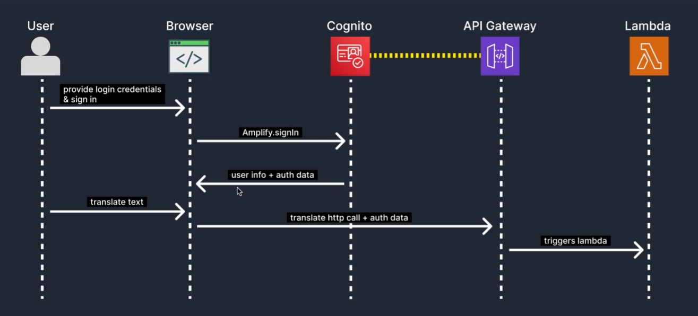

# 🌍 Language Translator — Full-Stack Serverless Application

A full-stack language translation application built with **Next.js**, **TypeScript**, and **AWS CDK** during a Udemy course and further refined independently.  
The application enables users to translate text between multiple languages using AWS cloud services and a fully serverless architecture.

🎓 **Udemy Certificate**  
👉 https://www.udemy.com/certificate/UC-7437c1eb-4df5-4bf9-88a1-d9b9aef23f5a/

---

## 🚀 Live Demo

The application is fully deployed and accessible online.  
🔗 **Production URL:** https://translateappdemo.site/

---

## ✨ Features

- 🌐 Text translation between multiple languages
- 🔐 User authentication and authorization
- ⚡ Serverless backend architecture
- ☁️ Cloud-based data storage
- 🔒 Secure HTTPS configuration
- 📈 Scalable and production-ready infrastructure

---

## 🛠️ Tech Stack

### Frontend
- **Next.js**
- **TypeScript**
- Server-Side Rendering (SSR)
- Client-Side Rendering (CSR)
- REST API integration

### Backend & Cloud (AWS)
- **AWS CDK** — Infrastructure as Code
- **AWS Lambda** — backend logic
- **AWS Translate** — language translation
- **Amazon DynamoDB** — data storage
- **Amazon Cognito** — authentication & user management
- **Amazon S3** — static assets storage
- **Amazon CloudFront** — content delivery network (CDN)
- **Amazon Route 53** — DNS management
- **AWS Certificate Manager** — SSL/TLS certificates

---

## 🧱 Architecture Overview

The application is built using a **serverless architecture**:

- Next.js frontend delivered via **CloudFront**
- Backend logic executed by **AWS Lambda**
- Authentication handled by **Amazon Cognito**
- Text translation powered by **AWS Translate**
- Data persisted in **Amazon DynamoDB**
- Infrastructure fully managed using **AWS CDK**
- No dedicated servers required

---

## 📦 Deployment

- Fully deployed on AWS
- Infrastructure defined and provisioned with **AWS CDK**
- HTTPS enabled via **AWS Certificate Manager**
- Global content delivery using **CloudFront**

---

## 🧪 What I Learned & Applied

- Designing and implementing serverless architectures
- Working with AWS services in a production-like environment
- Infrastructure as Code (IaC) principles
- Cloud scalability and deployment best practices

---

## 👨‍💻 Author
David Grigoryan
